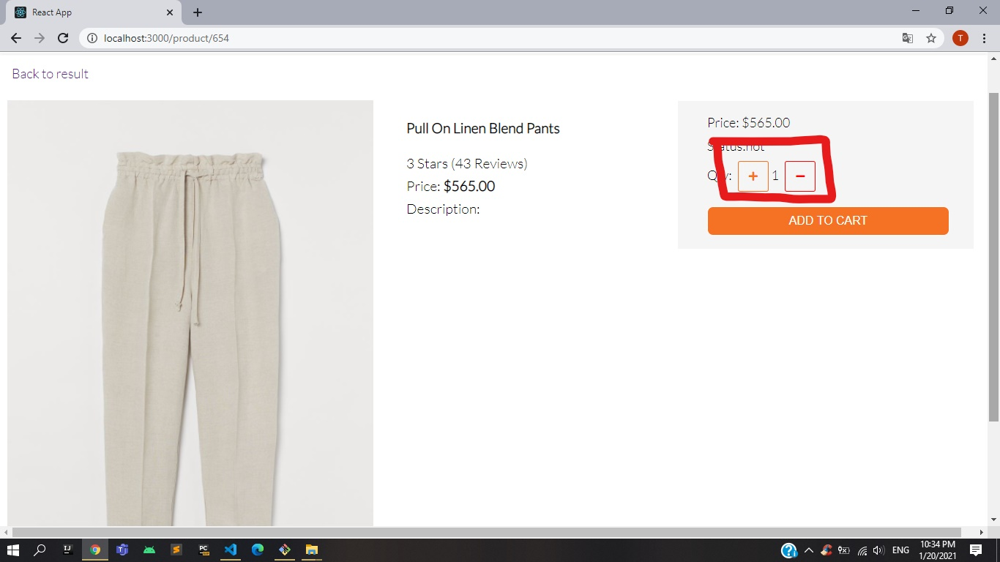

# **Tài liệu hướng dẫn sử dụng**
# Đề tài : Thiết kế frontend cho trang web bán hàng

## `Giới thiệu chung về đề tài`

### *Mục tiêu đề tài* 

Thiết kế frontend cho một trang web bán hàng thời trang 

### *Công cụ sử dụng*
* Ngôn ngữ : HTML ,  CSS , Javascript
* Framework : React JS
* Các kiến thức : 
1. CSS: Flexbox, Grid Layout
2. React: Context API, Hook API (useState,useReducer,useContext)

## `Các thành phần của website`

### *Gồm 5 webpage:*
1. Trang chủ
2. Đăng nhập / Đăng kí
3. Chi tiết sản phẩm
4. Giỏ hàng
5. Các sản phẩm cùng loại

## `Mô tả chức năng`

### *Các chức năng chính và phân rã từng chức năng*
1. Đăng nhập / Đăng kí
2. Tìm kiếm
3. Sắp xếp sản phẩm theo giá tiền : 
* **Từ cao đến thấp**
* **Từ thấp đến cao**
4. Lọc theo các khoảng giá
5. Xem chi tiết sản phẩm
6. Giỏ hàng:
* **Thêm vào giỏ hàng**
* **Tăng / giảm số lượng sản phẩm**
* **Xóa sản phẩm khỏi giỏ hàng**
7. Xem danh sách các sản phẩm thuộc vùng một loại

### ***Ý tưởng triển khai các chức năng***

* Tìm kiếm: Lấy xâu kí tự người dùng nhập vào <input type='text'>, tìm kiếm những sản phẩm mà tên sản phẩm chứa xâu người dùng nhập vào làm xâu con trên mảng tất cả các sản phẩm 
* Lọc : Cung cấp các lựa chọn cho người dùng sử dụng `<select>`, sau đó dựa vào điều kiện mà người dùng chọn  lọc ra các sản phẩm trên mảng tất cả các sản phẩm
* Sắp xếp: Có hai lựa chọn sắp xếp, ta sẽ dựa vào lựa chọn của người dùng, để thực hiện sắp xếp lại danh sách dựa trên mảng các sản phẩm người dùng lọc ra.
* Giỏ hàng: Sử dụng Context API, tạo ra một Context Provider để lưu trạng thái của giỏ hàng bao gồm một mảng các đối tượng sản phẩm , tổng số tiền các sản phẩm, tổng số lượng sản phẩm. Đối với mỗi chức năng giỏ hàng đều sẽ tác động làm thay đổi các biến trạng thái này từ đó hiển thị đến giao diện người dùng.

## `Hướng dẫn sử dụng các chức năng`
### ***Đăng nhập / Đăng kí:*** 
  - Step 1: Click vào nút  `Sign in` trong phần header để bắt đầu chức năng.
      
  - Step 2: Click `Log in` để mở giao diện dăng nhập, click `Register` để mở giao diện đăng kí.
      
  - Step 3: Nhập các thông tin yêu cầu.
      [Click để xem hướng dẫn](media/Signin/Signin3.jpg)
  - Step 4: 
   1. Hoàn thành đăng nhập bằng cách click  `Log In`  
   
   2. Hoàn thành đăng nhập bằng cách click  `Register` 
   
   
### ***Tìm kiếm:*** 
- Step 1: Nhập nội dung tìm kiếm vào <input>  

- Step 2: Sau đó nhấn vào nút  `search` để tìm kiếm 

### ***Sắp xếp sản phẩm theo giá tiền :*** 
* **Từ cao đến thấp**: Trong mục `Sort follow`, nhấn vào nút `Higher price`
 
* **Từ thấp đến cao**:Trong mục `Sort follow`, nhấn vào nút `Lower price`
 
### ***Lọc theo các khoảng giá:*** 
Trọng mục  `Filter`,  trong dropdown menu ,lựa chọn điều kiện muốn lọc
 
### ***Xem chi tiết sản phẩm:*** 
- Step 1: Nhấn vào hình ảnh sản phẩm,hoặc tên sản phẩm.
 
- Step 2: Lựa chọn số lượng sản phẩm bạn muốn bằng cách click `+` nếu muốn tăng, `-` nếu muốn giảm
 
- Step 3: Click `ADD TO CART` để thêm sản phẩm vào giỏ hàng
 
### ***Giỏ hàng:***
1. **Thêm vào giỏ hàng**: Nhấn nút  `ADD TO CART`
 
2. **Mở giao diện giỏ hàng**: Nhấn vào biểu tượng giỏ hàng ở phần header
 
3. **Tăng / giảm số lượng sản phẩm**:  Tại mỗi sản phẩm click chuột vào `+` nếu muốn tăng , `-` nếu muốn giảm.
 
4. **Xóa sản phẩm khỏi giỏ hàng**: Click vào biểu tượng `thùng rác` tại mỗi sản phẩm để xóa.
 
### ***Xem danh sách các sản phẩm thuộc vùng một loại:*** 
- Step 1: Mở SideBar
 
- Step 2: Click vào mục tương ứng với loại sản phẩm bạn cần xem.
 
